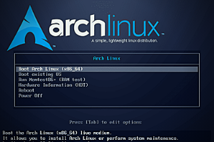

{:style="float: left;margin-right: 25px;margin-top: 10px;"} В этом видео я показываю быстрое разворачиванеи системы на своей машине.
Я использую скрипт, который написал на основе своего чек листа. Время на установку нулевой системы уходит 15 минут. В основном время тратится на скачивание. Все остальное происходит моментально.


## Как использовать скрипт
Скачивается и запускается скрипт следующей командой:  

```bash
wget git.io/arch1.sh && sh arch1.sh
```

Если нужен скринт для установки с UEFI https://github.com/ordanax/arch_install  

Скачивание и установка одной командой:

```bash
wget git.io/archuefi1.sh && sh archuefi1.sh
```
  
<div class="embed-responsive embed-responsive-16by9">
    <iframe frameborder="0" height="360" src="https://www.youtube.com/embed/nvVF_qKDUeM?rel=0" width="640"></iframe>
</div>
