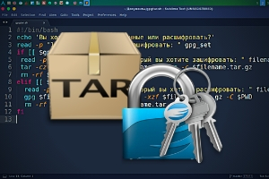

{:style="float: left;margin-right: 25px;margin-top: 10px;"} Сегодня встал вопрос архивации и шифровании большого объема даных.
Есть куча различных архиваторов, но пароли к ним легко подобрать. Также, когда объем данных очень большой, то гораздо удобнее и надежнее работать через консоль, без GUI.

Я решил использовать tar и gpg. Написал небольшой скрипт для себя, котрый выложил на GitHub https://github.com/ordanax/scripts/blob/master/gpgtar.sh

## Как как пользоваться
Скачиваем и запускаем скрипт командой:

```bash
wget git.io/gpgtar.sh && sh gpgtar.sh
```

Далее выбираете из пунктов, что именно вы хотите сделать.

## Видео демонстрация работы скрипта
[](http://www.youtube.com/watch?v=OK9U4Hf5-6w)

iframe
<iframe width="560" height="315" src="https://www.youtube.com/embed/OK9U4Hf5-6w" frameborder="0" allow="accelerometer; autoplay; encrypted-media; gyroscope; picture-in-picture" allowfullscreen></iframe>
