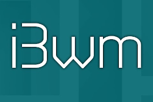

{:style="float: left;margin-right: 25px;margin-top: 10px;"} В этой статье расписал, как я настроил под свои нужды i3wm. Конечно же тут можно многое еще что добавить и настроить. Можно поставить и полибар и разные плюшечки, можно поставить также и rofi для "более удобного" поиска установленных программ, но мне как-то и так хорошо. Вы если хотите можете все это себе поставить. Я даю тут все в упрощенном варианте и без особых наворотов. Далее уже вы сами подстраивате конфиги под свой вкус и цвет, под свои "фломастеры".


# Простой вариант установки и настройки i3wm (минимализм)

## Ссылки
[Официальная документация по i3wm](https://i3wm.org/docs/userguide.html)<br>
[Документация по i3status](https://jlk.fjfi.cvut.cz/arch/manpages/man/i3status.1)<br>
[i3wm в ArchWiki](https://wiki.archlinux.org/index.php/i3_%28%D0%A0%D1%83%D1%81%D1%81%D0%BA%D0%B8%D0%B9%29)<br>
[Мой конфиг с пояснениями внутри](https://github.com/ordanax/dots/tree/master/i3wm)


## Установка
Сначала давайте установим все, что нам понадобится. При этом помним, что это вариант минимализма. Чтобы понять, что к чему, а далее уже будем делать рюшечки :)

**Нам понадобится:**
 1. **i3wm** - оконный менеджер и его форк (ответвление) **i3-gaps**
 2. **i3status**  - вывода строки статуса в i3bar
 3. **dmenu** - утилита для запуска программ
 4. **ttf-font-awesome** - шрифтовые иконки
 5. **feh** - установка обоины на рабочий стол
 6. **lxappearance** - установка тем для окон, иконок, курсора
 7. **pcmanfm** - файловый менеджер
 8. **gvfs** и **udiskie** - для авто монтирования внешних дисков
 9. **xorg-xbacklight** - для управлением яркостью экрана
 10. **ristretto** и **tumbler** - для просмотра фото
 11. **compton** - для прозрачности окон и для устранения тиринга
 
Можно еще поставить **sbxkb** - индикатор раскладки и переключения клавиатуры, но можно и без этого! Когда вы последний раз смотрели на раскладку? Уверены, что это вам нужно? Еслитакой вариант переклюения клавиатуры вам не нравтся, а хотите тектовой, то есть другой вариант, но для этого вам уже нужно будет ставить polibar. Если нужно то пишите в комментах. Будет много желающих напишу как это делать.

**Ставим пакеты из pacman**:

```sh
# pacman -S i3-wm i3-gaps i3status sbxkb dmenu pcmanfm ttf-font-awesome feh lxappearance thunar gvfs udiskie xorg-xbacklight ristretto tumbler compton
```

## Настройка конфига i3wm
При первичной загрузке вы увидите примерно такое сообщение:


Нажмите 2 раза на Enter - это создаст конфигурационный файл, который мы потом будем менять.
Вы увидите просто черный экран и возможно курсор мыши :)))
Не пугайтесь все нормально, система работает и вы сделали все правильно.

Зачастую можно видеть символ загрузки, который постоянно вращается (до 60 сек.) - система пытается запустить какой-то процесс. 
Если вас это раздражает, то можно убрать прописав перед запуском программ код:
```sh
--no-startup-id
```
### Обои на рабочий стол
Устанавливаем обои на рабочий стол

```sh
exec --no-startup-id feh --bg-scale /usr/share/backgrounds/xfce/bg.jpg
```
### Автозагрузка программ
Прописываем автозагрузку программ кодом

```sh
exec --no-startup-id flameshot
```


### Отключение заголовков окон
Я предпочел отключить заголовки окон. Освободив дополнительное пространство на рабочем столе.
```sh
default_border pixel
```
### Настройка толщины рамки i3wm
Для увеличение толщины рамки, чтобы было лучше видно активное окно используем следующий код:
```
for_window [tiling] border pixel 3
```
### Горячие клавиши по умолчанию в i3wm


### Назначаем свои горячие клавиши
Прописываем запуск программ на определенных горячих клавишах:
```
bindsym $mod+F1 exec firefox
 bindsym $mod+F3 exec subl
 bindsym $mod+F4 exec cherrytree
 bindsym $mod+F5 exec galculator
```
Я, к примеру, использую консольный вариант проигрывателя VLC, запуская его горячими клавишами. При этом, радио начинает играть автоматом. Авто подключение радио потока прописано в настройках vlc. 
```
bindsym $mod+Home exec cvlc
```
И т.к. программа запускается без GUI, ее удобнее выключать горячими клавишами, которые просто убивают процесс vlc.

### Убить процесс
Для того, чтобы убить процесс использую команду killall -s 6
```
bindsym $mod+Prior exec killall -s 6 vlc
```
### Как найти название клавиш
Тут возникает вопрос, что за клавиша такая "Prior", которую мы использовали выше и как вообще найти название клавиш, которые нам хотелось бы использовать.
Клавиша "Prior" - на моей клавиатуре это клавиша Pg Up/■ . Используется для управлением проигрывателя (старт, стоп, пауза, перемотка и т.д.)
Для того, чтобы найти название клавиш используем утилиту **xev**, вбив в консоли команду:
```
xev
```
После запуска, вы увидите белый экран с квадратом вверху


Подведите курсор мышки к квадрату и не уводя с него, нажмите на нужную клавишу. В терминале увидите ее название.

Думаю тут все понятно не вызовет никаких трудностей. Идем дальше.

### Открытие программ в плавающем окне
Если определенную программу нужно открыть не в тайлинге, а в плавающем окне используйте код
```
for_window [class="Xfce4-terminal"] floating enable
```
Где "Xfce4-terminal" это название программы.

### Открытие программ в нужном рабочем столе
В i3wm есть фишка, которую я не встречал в других DE/WM - это запуск программ на определенном рабочем столе.  Удобно, когда вы знаете, какая программа и на каком рабочем столе она запускается.

Данный код запустит Firefox на 3-м рабочем столе
```
for_window [class="Firefox"] move to workspace $ws3
```
Название программ нужно писать с заглавной буквы, иначе не сработает.

### Регулировка яркости экрана
Управление яркостью экрана, нужно установить xbacklight. Он у вас уже должен стоять, если вы следуете этому ману.

```
bindsym XF86MonBrightnessUp exec xbacklight -inc 20
 bindsym XF86MonBrightnessDown exec xbacklight -dec 20
```

## Настройка конфига i3status
### Копирование конфига
Прежде чем вносить изменения, нужно скопировать настройки для i3status.

Для этого сначала создадим папку i3status (если у вас ее нет).
```sh
$ mkdir ~/.config/i3status
```
Далее копируем конфиг в домашнюю директорию, выполнив следующий код:
```sh
$ cp /etc/i3status.conf ~/.config/i3status/config
```
### Настройки конфига i3status
Все иконки можете брать с сайта [fontawesome](https://fontawesome.com/cheatsheet?from=io) и вставлять в конфиг


### Индикатор звука
Для того, чтобы у вас был индикатор звука используйте код:
```sh
volume master {
        format = " %volume"
        format_muted = ""
        device = "default"
        mixer =  "Master"
        mixer_idx = 0
        
}
```
Тут особо расписывать нечего. Смотрите  [мои настройки конфиг i3status](https://raw.githubusercontent.com/ordanax/dots/master/i3wm_v_1/i3status/config)

Дополнительные настройки смотрите в [документации по i3status](https://jlk.fjfi.cvut.cz/arch/manpages/man/i3status.1)

## Мой новый конфиг и дополнительные настройки i3wm + polybar
Я сделал второй кнфиг, он с polibar, с плагином погоды, с индикатором переключения клавиатуры и другими вещами.
[Сам конфиг по ссылке](https://github.com/ordanax/dots/tree/master/i3wm_v_2)

Вот, что вы в результате получите с этим конфигом


## Заключение
Надеюсь статья была вам полезна. Пишите вопросы и пожелания в комментариях и в нашей группе [ https://vk.com/arch4u]( https://vk.com/arch4u)

## Настройка i3wm - видео
<div class="embed-responsive embed-responsive-16by9">
    <iframe frameborder="0" height="360" width="640" src="https://www.youtube.com/embed/kQT11RANDG8?rel=0" ></iframe>
</div>

Если есть вопросв, то пишите в Телеграм чат:

<noindex><a href="https://t.me/linux4at"></a></noindex>
