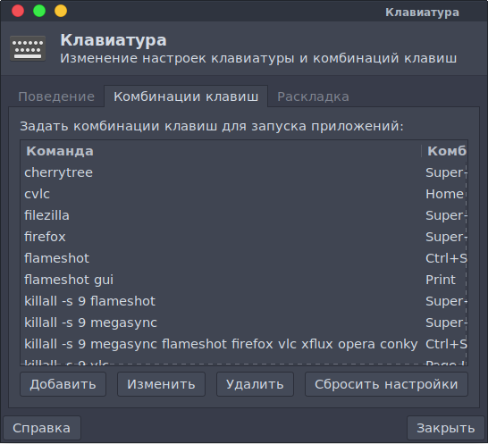

{:style="float: left;margin-right: 25px;margin-top: 10px;"}
После того как я вкусил все прелести i3wm мне захотелось также настроить и горячие клавиши в Xfce, но я столкунулся с тем, что не все можно настроить через стандартное приложение keyboard

В частности через обычное приложение нельзя настроить так, чтобы окно закрывалось на через комбинацию Alt+F4, а через Mod+q как это было у меня в i3/

Я начал ковырять систему в поисках файла куда все это дело сохраняется и нашел настройки в файле: 

```sh
~/.config/xfce4/xfconf/xfce-perchannel-xml/xfce4-keyboard-shortcuts.xml
```
Тут вы можете переиначить абсолютно все клавиши, которые вам нужны точно так же как и в i3wm

В ручную можно настраивать те клавиши, которые нельзя настроить через keyboard, остальное все моно настроить через стандартное приложение.



## Как найти название клавиш
Точно также как я и писал [в статье по i3wm](https://ordanax.github.io/i3wm)

