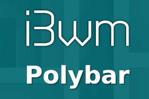

{:style="float: left;margin-right: 25px;margin-top: 10px;"} В [прошлой статье](https://ordanax.github.io/i3wm) я рассказывал об минимальной установке и настройка i3wm с i3status.
В этой статье мы копнем немного глубже, установим и на строим i3wm c polybar. Так же установим необходимые скрипты. Заменим привычный pamac на упрощенный индикатор обновлений.


# Установка и настройка i3wm + polybar

## Ссылки
[Официальная документация по i3wm](https://i3wm.org/docs/userguide.html)<br>
[i3wm в ArchWiki](https://wiki.archlinux.org/index.php/i3_%28%D0%A0%D1%83%D1%81%D1%81%D0%BA%D0%B8%D0%B9%29)<br>
[Мой конфиг с пояснениями внутри](https://github.com/ordanax/dots/tree/master/i3wm)<br>

Ставим необходимые пакеты.

```
#pacman -S i3-wm polybar dmenu pcmanfm ttf-font-awesome feh gvfs udiskie xorg-xbacklight ristretto tumbler picom jq
```
```
$yay -S polybar ttf-weather-icons ttf-clear-sans tlp
```

**Нам понадобится:** <br>
    1. **i3wm** — оконный менеджер или его форк (ответвление) i3-gaps <br>
    2. **Polybar** — наша панелька<br>
    3. **dmenu** — утилита для запуска программ <br>
    4. **ttf-font-awesome** — шрифтовые иконки <br>
    5. **feh** — установка обоины на рабочий стол <br>
    6. **xorg-xbacklight** — для парвелнием яркостью экрана<br>
    7. **pcmanfm** — файловый менеджер <br>
    8. **gvfs** и **udiskie** — для авто монтирования внешних дисков <br>
    9. **xorg-xbacklight** — для управлением яркостью экрана <br>
    10. **ristretto** и **tumbler** — для просмотра фото <br>
    11. **picom** — для прозрачности окон и для устранения тиринга (вместо compton)<br>
    12. **ttf-weather-icons** — Иконнки для скрипта погоды<br>
    13. **jq** — этот пакет также нужен для скрипта для отображения погоды<br>
    14. **tlp** — для скрипта отображения количества обновлении<br>
    15. **ttf-clear-sans** — хороший шрифт<br>

**Настройки тем делаем правкой файлов настройки GTK:**
1. [~/.gtkrc-2.0](https://github.com/ordanax/dots/blob/master/3wm_v_3/gtkrc-2.0.tar.gz) и <br>
2. [~/.config/gtk-3.0/settings.ini](https://github.com/ordanax/dots/blob/master/3wm_v_3/gtk-3.0/settings.ini)<br> 
Я использовал ручную настройку, если вам больше нарвится настройка с GUI то используйте для этих целей пакет **lxappearance**


## Подключение скриптов

В своей настройке я использовал 3 скрипта:<br>
1) Первый это скрипт погоды<br>
2) Второй это скрипт для отображения количества обновлений в системе вместо pamac. <br>
3) Третий для отображения заряда батареи<br>

Эти скрипты и инструкцию к ним смотрите тут [https://github.com/x70b1/polybar-scripts.git](https://github.com/x70b1/polybar-scripts.git)<br>
Там большое кол-во скриптов, найдете все, что вам по душе.

