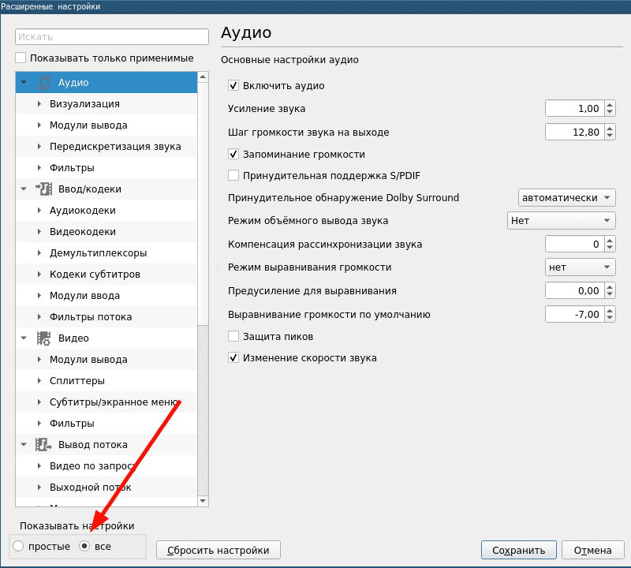
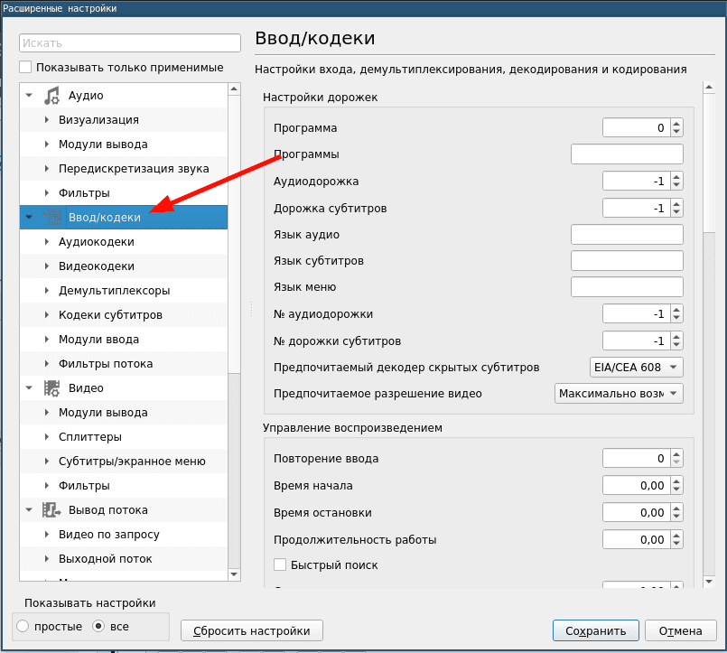
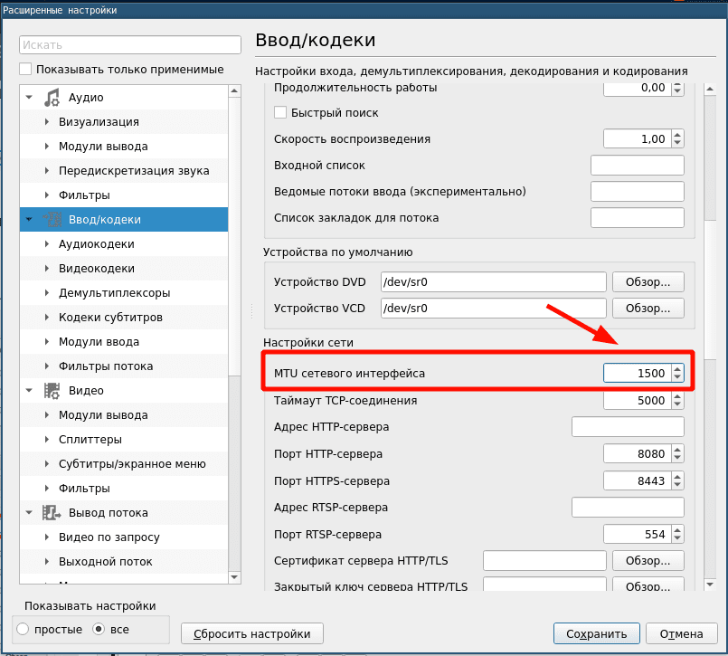
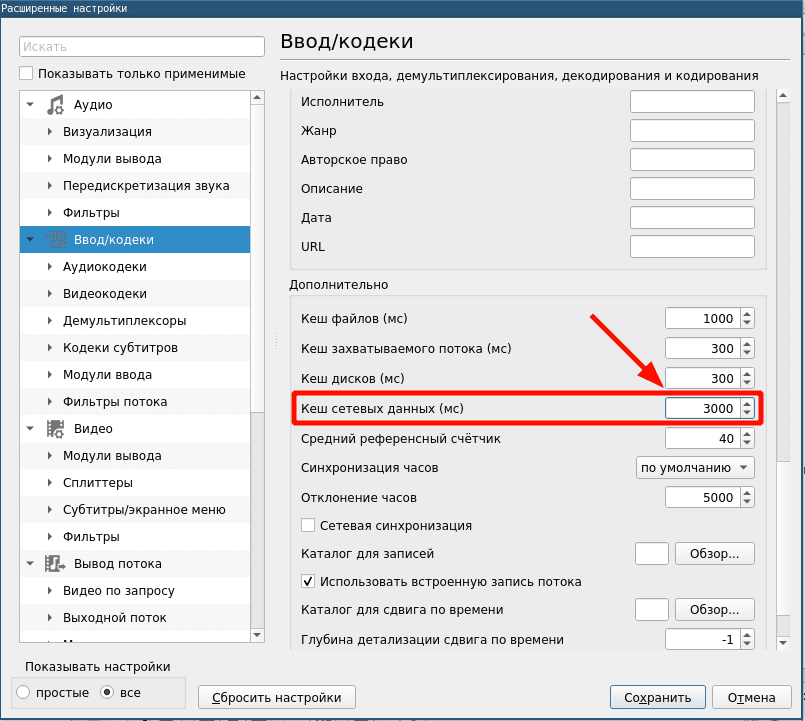
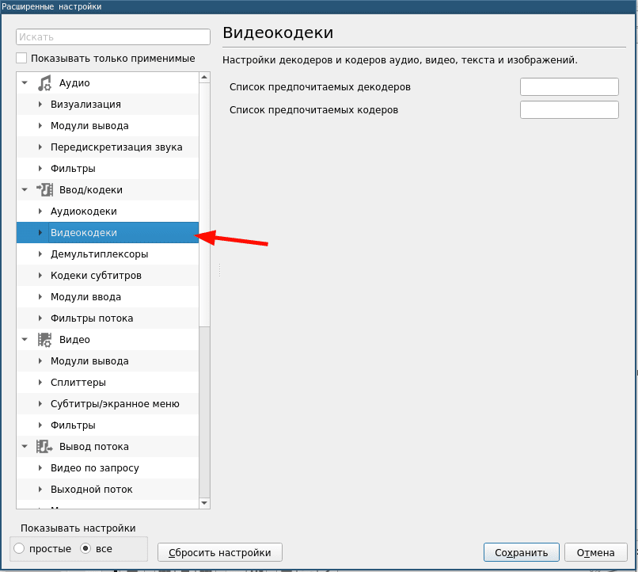
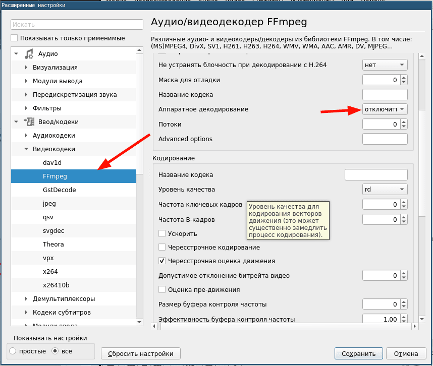

{:style="float: left;margin-right: 25px;margin-top: 10px;"} VLC уникальный проигрыватель, в котором столько функций, что многие даже не догадываются о том, сколько их. 
Одна их многих его особенностей это проигрывание IPTV с расширением m3u. Если не правильно настроить VLC, то IPTV будет подтормаживать.
Чтобы не было тормозов нужно настроить правильно как видеокодек, так и кэширование.

Все, что нужно сделать на этих скриншотах.

Переходим в настройки и включаем "все"

Жмем на кодеки

Параметр в MTU сетевого интерфейса ставим 1500

Кеш сетевых данных выставляем на 3000

Переходим в видеокодеки

Выбираем FFmpeg и отключаем аппаратное кодирование

Как правило этим монипуляций достаточно, чтобы избавиться от торможений. Если все таки тормоза есть, то попробуйте поиграться с кешем.
