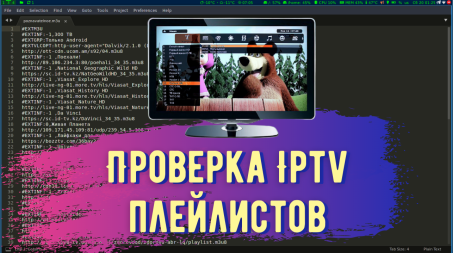

{:style="float: left;margin-right: 25px;margin-top: 10px;"} В этой статье я расскажу как ползоваться консольным iptv checker для проверки iptv плейлистов. Тут мы не будем рассморивать,где брать бесплатные iptv плейлисты. Это легко гуглится. Набирате "плейлисты для iptv m3u" или "самообновляемые плейлисты iptv" и найдете их предостаточно! Тут я покажу как их проверить, т.к. со временем некоторые каналы умирают и проверять их в ручную это очень геморно особенно когда в плейлисте больше 500 каналов.

## Установка
Для начала установим сам iptv-checker командой

```
npm install -g iptv-checker
```
## Настройка и запуск iptv-checker
 -o (служит для указания пути сохранения файлов с результами работы)
 -t (время для проверки потока в мс, ставим 60000) 
 
## Пример команды для запуска
```
$ iptv-checker /home/user/list.m3u -o /home/user/iptv_checker -t 60000
``` 

 где, /home/user/list.m3u (путь к плейтисту, который мы проверяем),

 -o /home/user/iptv_checker (папка куда сохраняем результаты проверки),

 -t 60000 (это время отведенное для проверки потока в миллисекундах (1 секунда- 1000 миллисекунд)).
 
 Проверенные каналы можно просматривать в VLC или любом другом плейере, который позволяет это делать.
 Чтобы VLC не тормозил нужно сделать простые настройки. Как это сделать смотрите в статье ["Настройка VLC для просмотра IPTV"](https://ordanax.github.io/nastrojka-vlc-dlya-prosmotra-iptv)
 
 Если понравилась статья поделись ею!
 
