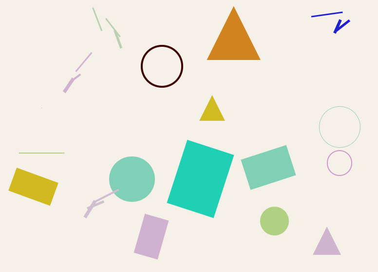

{:style="float: left;margin-right: 25px;margin-top: 10px;"} Color Key — это уникальный инструмент для стеганографии, который позволяет кодировать любой текст в CSS-картины через HEX-цвета. Скрипт преобразует текст в последовательность цветов, которые можно сохранить как CSS-код и затем расшифровать обратно в исходный текст.

## Как это работает

Алгоритм кодирования состоит из нескольких этапов:

1. **Текст → UTF-8 байты** — исходный текст преобразуется в байты UTF-8
2. **UTF-8 → HEX** — байты конвертируются в шестнадцатеричное представление
3. **HEX → блоки по 6 символов** — строка разбивается на блоки по 6 символов (стандартная длина HEX-цвета)
4. **Добавление индекс-префикса** — каждому блоку добавляется префикс (00, 02, 04, ...) для сохранения порядка
5. **Блок → цвет** — каждый блок с префиксом становится HEX-цветом
6. **Цвета → CSS-картина** — цвета оформляются в CSS с атрибутом `title="#HEX"`

## Основные возможности

### Кодирование текста

Вставьте любой текст в поле ввода, и скрипт автоматически преобразует его в CSS-картину:

```css
div {
  background: #0048656C;
  title="#0048656C";
}
```

Каждый цвет содержит зашифрованную часть текста с индексом для восстановления порядка.

### Парсинг CSS

Для расшифровки достаточно вставить весь CSS-код картины — скрипт автоматически найдёт все `title="#HEX"` и восстановит исходный текст:

- Скрипт ищет все атрибуты `title` с HEX-значениями
- Извлекает индексы из префиксов цветов
- Сортирует блоки по индексам
- Собирает исходный текст из отсортированных HEX-значений

### Автосортировка

Порядок цветов в CSS не важен — индексы внутри цветов позволяют автоматически восстановить правильную последовательность данных.

## Преимущества

- **Визуальное представление** — текст превращается в абстрактную картину из цветов
- **Возможность печати** — картину можно распечатать и считывать цвета пипеткой
- **Чистые HEX-цвета** — без прозрачности, только валидные CSS-цвета
- **Обратимое преобразование** — гарантированное восстановление исходного текста
- **Работает в браузере** — не требует сервера, всё происходит на клиенте

## Пример использования

### Кодирование

1. Откройте [color_key.html](https://ordanax.github.io/color_key.html)
2. Введите текст в поле ввода
3. Скопируйте сгенерированный CSS-код

### Расшифровка

1. Откройте [color_key.html](https://ordanax.github.io/color_key.html)
2. Вставьте CSS-код в поле для парсинга
3. Нажмите кнопку расшифровки
4. Получите исходный текст

## Технические детали

### Формат блока

Каждый блок данных имеет формат:

```
ПРЕФИКС(2 символа) + ДАННЫЕ(6 символов) = 8 символов
```

- Префикс: `00`, `02`, `04`, `06`, ... — индекс блока
- Данные: 6 символов HEX — закодированная часть текста

Пример:
- `0048656C` — индекс 00, данные `48656C` (соответствует части UTF-8 строки)

### Ограничения

- Длина текста ограничена только количеством цветов, которые можно сохранить
- Поддерживаются только символы UTF-8
- CSS-код должен содержать валидные HEX-цветы с атрибутами `title`

## Применение

- **Стеганография** — скрытие текста в визуальных данных
- **Художественное кодирование** — превращение сообщений в абстрактные картины
- **Обучение** — демонстрация принципов кодирования данных
- **Развлечение** — создание загадок и криптограмм

## Демонстрация

Попробуйте скрипт: [https://ordanax.github.io/color_key.html](https://ordanax.github.io/color_key.html)

---

**Автор:** [ordanax.github.io](https://ordanax.github.io/)  
**Telegram:** [@linux4at](https://t.me/linux4at)  
**MAX:** [Присоединиться](https://max.ru/join/b4GtiNvbjYqeboq-nddswKQJ-cvWiJGoaZdIoV1EUMk)
