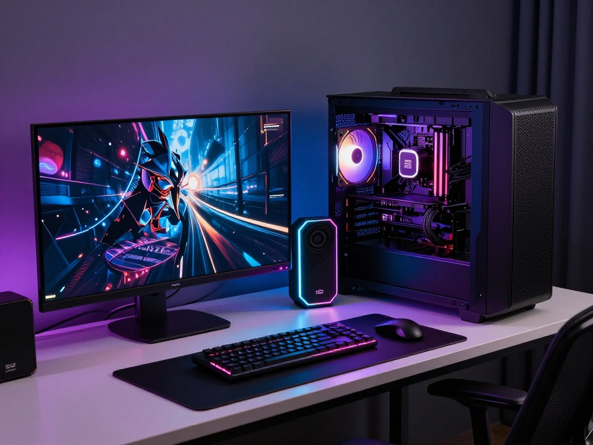

{:style="float: left;margin-right: 25px;margin-top: 10px;"} Всем привет! Ребят, обращаюсь как к своим.

## Почему мне нужна помощь

Коплю на новый ПК. Текущий уже не справляется с задачами — хочется создавать качественный контент, записывать видео, тестировать дистрибутивы без лагов и зависаний.

Если есть возможность и желание — поддержите кто сколько может. Даже небольшая сумма очень поможет.

👉 **Поддержать проект:** https://pay.cloudtips.ru/p/11ed39f2

## Что я делаю для сообщества

За время ведения канала я помог сотням пользователей:

- **Создал чат по Linux** — уже более **1897 человек** общаются, делятся опытом, помогают друг другу
- **Главное правило чата** — УВАЖИТЕЛЬНОЕ общение. Без токсичности, без флуда — только конструктивный диалог
- **После блокировки Telegram** сделал чат в MAX — мы не бросаем своих
- **Пишу статьи и гайды** по Arch Linux, настройке i3wm, Samba, и многому другому
- **Отвечаю на вопросы** в чатах и комментариях — помогаю новичкам и продвинутым пользователям

## Где найти меня

- **Чат по Linux в Telegram:** 👉 https://t.me/linux4at
- **Чат в MAX:** 👉 https://max.ru/join/b4GtiNvbjYqeboq-nddswKQJ-cvWiJGoaZdIoV1EUMk

## Что вы получите взамен

На новом ПК я установлю **Arch Linux** и запишу **подробное видео** по сборке ПК и настройке системы.

В видео покажу:
- Выбор комплектующих для Linux
- Сборку ПК с нуля
- Установку Arch Linux (не UEFI, а классический способ)
- Настройку i3wm, Polybar, Picom
- Оптимизацию системы
- Решение типичных проблем

Это видео будет полезно всем, кто хочет собрать свой ПК под Linux или перейти на Arch.

## Почему стоит поддержать

- **Конкретная цель** — деньги пойдут на железо, а не "на жизнь"
- **Прозрачность** — опубликую список комплектующих и чеки
- **Взаимность** — видео-гайд в подарок всем поддержавшим
- **Сообщество** — вы помогаете не только мне, но и всем, кто учится по моим материалам
- **Доказательство пользы** — 1897+ человек в чате — это не просто цифры, это живое сообщество

## Любая сумма важна

Не думайте, что маленькая сумма ничего не изменит. 100 рублей от 100 человек — это уже 10 000 рублей. Вместе мы можем собрать быстрее.

Спасибо каждому, кто поддержит! 🙏

---

**Автор:** [ordanax.github.io](https://ordanax.github.io/)  
**Telegram:** [@linux4at](https://t.me/linux4at)  
**MAX:** [Присоединиться](https://max.ru/join/b4GtiNvbjYqeboq-nddswKQJ-cvWiJGoaZdIoV1EUMk)
