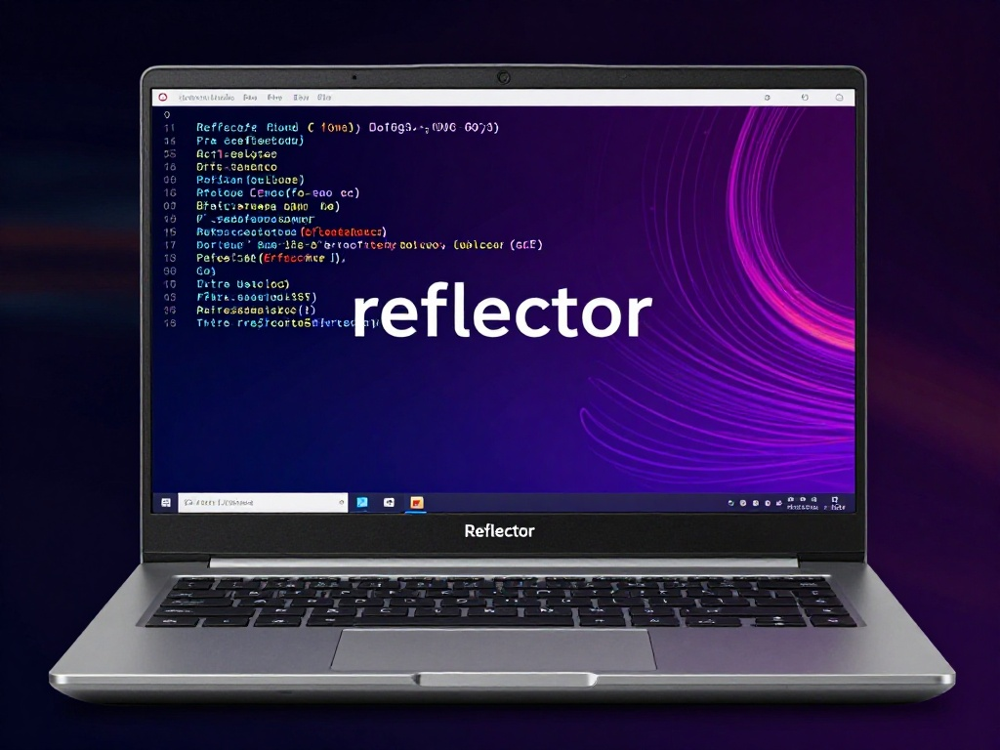

{:style="float: left;margin-right: 25px;margin-top: 10px;"} Правильная настройка mirrorlist в Arch Linux критически важна для скорости обновлений системы. Reflector — инструмент для автоматического выбора самых быстрых зеркал.

## Установка Reflector

```bash
sudo pacman -S reflector
```

## Резервное копирование текущего mirrorlist

```bash
sudo cp /etc/pacman.d/mirrorlist /etc/pacman.d/mirrorlist.backup
```

## Автоматический выбор зеркал

### Базовая команда

```bash
sudo reflector --latest 25 --country RU,NL,BY --sort rate --save /etc/pacman.d/mirrorlist
```

- `--latest 25` — выбрать 25 последних обновлённых зеркал
- `--country RU,NL,BY` — использовать зеркала из указанных стран
- `--sort rate` — сортировать по скорости
- `--save` — сохранить в указанный файл

### Расширенная команда с фильтрацией

```bash
sudo reflector \
  --latest 25 \
  --country RU,NL,BY,DE,UA \
  --protocol https \
  --completion-percent 100 \
  --sort rate \
  --save /etc/pacman.d/mirrorlist
```

- `--protocol https` — только HTTPS зеркала (безопаснее)
- `--completion-percent 100` — только полностью синхронизированные зеркала
- Дополнительные страны для большего выбора

## Проверка результата

```bash
cat /etc/pacman.d/mirrorlist
```

Должны увидеть список зеркал, отсортированный по скорости.

## Обновление системы

```bash
sudo pacman -Syu
```

## Автоматическое обновление mirrorlist

### Через systemd timer

Создайте сервис:
```bash
sudo nano /etc/systemd/system/reflector.service
```

```ini
[Unit]
Description=Update pacman mirrorlist
After=network-online.target
Wants=network-online.target

[Service]
Type=oneshot
ExecStart=/usr/bin/reflector --latest 25 --country RU,NL,BY --protocol https --sort rate --save /etc/pacman.d/mirrorlist
```

Создайте таймер:
```bash
sudo nano /etc/systemd/system/reflector.timer
```

```ini
[Unit]
Description=Run reflector weekly
Requires=reflector.service

[Timer]
OnCalendar=weekly
Persistent=true

[Install]
WantedBy=timers.target
```

Включите таймер:
```bash
sudo systemctl enable reflector.timer
sudo systemctl start reflector.timer
```

### Через cron (альтернативный метод)

```bash
sudo crontab -e
```

Добавьте:
```
0 0 * * 0 /usr/bin/reflector --latest 25 --country RU,NL,BY --protocol https --sort rate --save /etc/pacman.d/mirrorlist
```

## Ручной выбор зеркал

Если автоматический выбор не даёт желаемых результатов, можно выбрать зеркала вручную:

```bash
sudo reflector --list https --country RU,NL,BY --sort rate
```

Скопируйте нужные зеркала в `/etc/pacman.d/mirrorlist` вручную.

## Решение проблем

### Проблема: Reflector не находит зеркала

Проверьте подключение к интернету:
```bash
ping archlinux.org
```

Попробуйте без фильтрации по странам:
```bash
sudo reflector --latest 50 --sort rate --save /etc/pacman.d/mirrorlist
```

### Проблема: Медленные обновления после настройки

Проверьте, что mirrorlist обновился:
```bash
cat /etc/pacman.d/mirrorlist
```

Попробуйте другие страны:
```bash
sudo reflector --latest 25 --country DE,FR,PL --sort rate --save /etc/pacman.d/mirrorlist
```

### Проблема: Ошибка при обновлении системы

Восстановите из бэкапа:
```bash
sudo cp /etc/pacman.d/mirrorlist.backup /etc/pacman.d/mirrorlist
```

## Полезные команды

```bash
# Проверить скорость зеркал без сохранения
sudo reflector --latest 25 --country RU,NL,BY --sort rate

# Показать все доступные зеркала
sudo reflector --list-countries

# Проверить статус зеркал
sudo reflector --score 10 --sort rate
```

## Рекомендации

1. **Используйте HTTPS зеркала** для безопасности
2. **Делайте бэкап** перед изменениями
3. **Настройте автоматическое обновление** через systemd timer
4. **Проверяйте результат** после каждого обновления mirrorlist
5. **Используйте несколько стран** для большей надёжности

## Полезные ресурсы

- [ArchWiki: Reflector](https://wiki.archlinux.org/title/Reflector)
- [ArchWiki: Mirrors](https://wiki.archlinux.org/title/Mirrors)
- [Mirror Status](https://archlinux.org/mirrors/status/)

---

**Автор:** [ordanax.github.io](https://ordanax.github.io/)  
**Telegram:** [@linux4at](https://t.me/linux4at)  
**MAX:** [Присоединиться](https://max.ru/join/b4GtiNvbjYqeboq-nddswKQJ-cvWiJGoaZdIoV1EUMk)
