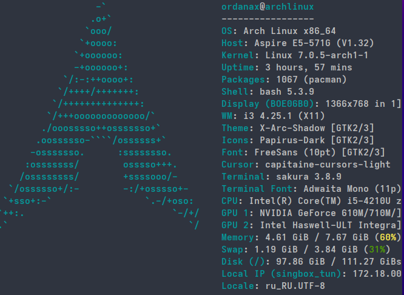

{:style="float: left;margin-right: 25px;margin-top: 10px;"} Fastfetch — современная альтернатива neofetch с поддержкой GPU ускорения и расширенными возможностями. Показывает информацию о системе в красивом формате.

## Установка Fastfetch

### Arch Linux

```bash
sudo pacman -S fastfetch
```

### Ubuntu/Debian

```bash
sudo apt install fastfetch
```

### Fedora

```bash
sudo dnf install fastfetch
```

### Из исходников

```bash
git clone https://github.com/LinusDierheimer/fastfetch
cd fastfetch
cmake -B build -DCMAKE_BUILD_TYPE=Release
cmake --build build
sudo cmake --install build
```

## Базовое использование

### Запуск

```bash
fastfetch
```

### Показать все конфигурации

```bash
fastfetch --config examples/x.jsonc
```

Где x — число от 1 до 30 (разные пресеты).

## Конфигурация

### Расположение конфигурационного файла

Конфигурация Fastfetch находится в:
```
~/.config/fastfetch/config.jsonc
```

### Создание конфигурации

```bash
mkdir -p ~/.config/fastfetch
nano ~/.config/fastfetch/config.jsonc
```

## Базовая конфигурация

```jsonc
{
  "$schema": "https://github.com/LinusDierheimer/fastfetch/raw/master/doc/json_schema.json",
  "logo": {
    "type": "small",
    "paddingRight": 3
  },
  "modules": [
    "title",
    "separator",
    "os",
    "kernel",
    "uptime",
    "packages",
    "shell",
    "resolution",
    "de",
    "wm",
    "theme",
    "cpu",
    "gpu",
    "memory",
    "disk",
    "battery",
    "locale",
    "localip",
    "publicip",
    "weather",
    "separator",
    "colors"
  ]
}
```

## Настройка модулей

### Отключение модулей

```jsonc
{
  "modules": [
    "title",
    "os",
    "kernel",
    // "packages",  // закомментировано
    "shell"
  ]
}
```

### Кастомизация модуля CPU

```jsonc
{
  "modules": [
    {
      "type": "cpu",
      "key": "CPU",
      "keyColor": "blue"
    }
  ]
}
```

### Настройка логотипа

```jsonc
{
  "logo": {
    "type": "small",
    "paddingRight": 3,
    "color": {
      "1": "blue",
      "2": "cyan"
    }
  }
}
```

## Пресеты конфигураций

### Просмотр пресетов

```bash
fastfetch --config examples/1.jsonc
fastfetch --config examples/2.jsonc
# ... до 30
```

### Использование конкретного пресета

```bash
fastfetch --config examples/10.jsonc
```

## Настройка цветов

### Изменение цветовой схемы

```jsonc
{
  "display": {
    "color": {
      "keys": "blue",
      "title": "green",
      "separator": "white"
    }
  }
}
```

### Кастомные цвета

```jsonc
{
  "display": {
    "color": {
      "keys": "#00ff00",
      "title": "#ff0000"
    }
  }
}
```

## Интеграция с shell

### Zsh интеграция

Добавьте в `~/.zshrc`:
```bash
fastfetch
```

### Bash интеграция

Добавьте в `~/.bashrc`:
```bash
fastfetch
```

### Запуск при каждом открытии терминала

```bash
echo 'fastfetch' >> ~/.bashrc
```

## Решение проблем

### Проблема: Конфигурация не применяется

1. Проверьте путь к конфигурационному файлу
2. Проверьте синтаксис JSON
3. Попробуйте использовать пресет

### Проблема: Логотип не отображается

```jsonc
{
  "logo": {
    "type": "none"
  }
}
```

### Проблема: Модули не показываются

Проверьте, что модуль поддерживается в вашей системе:
```bash
fastfetch --help
```

## Полезные команды

```bash
# Показать информацию о версии
fastfetch --version

# Показать справку
fastfetch --help

# Показать структуру JSON
fastfetch --print-config

# Тестовый режим
fastfetch --test
```

## Сравнение с neofetch

### Преимущества Fastfetch

- GPU ускорение
- Более быстрая работа
- JSON конфигурация
- Большее количество модулей
- Лучшее качество отображения

### Миграция с neofetch

Если вы использовали neofetch, Fastfetch использует похожий синтаксис конфигурации, но с JSON вместо текстового формата.

## Рекомендации

1. **Используйте пресеты** для начала
2. **Настройте автозапуск** в shell конфиге
3. **Экспериментируйте с модулями** для оптимального отображения
4. **Делайте бэкап конфигурации** перед изменениями
5. **Используйте JSON валидацию** для проверки синтаксиса

## Полезные ресурсы

- [Fastfetch GitHub](https://github.com/LinusDierheimer/fastfetch)
- [Fastfetch Documentation](https://github.com/LinusDierheimer/fastfetch/wiki)
- [Neofetch](https://github.com/dylanaraps/neofetch)

---

**Автор:** [ordanax.github.io](https://ordanax.github.io/)  
**Telegram:** [@linux4at](https://t.me/linux4at)  
**MAX:** [Присоединиться](https://max.ru/join/b4GtiNvbjYqeboq-nddswKQJ-cvWiJGoaZdIoV1EUMk)
