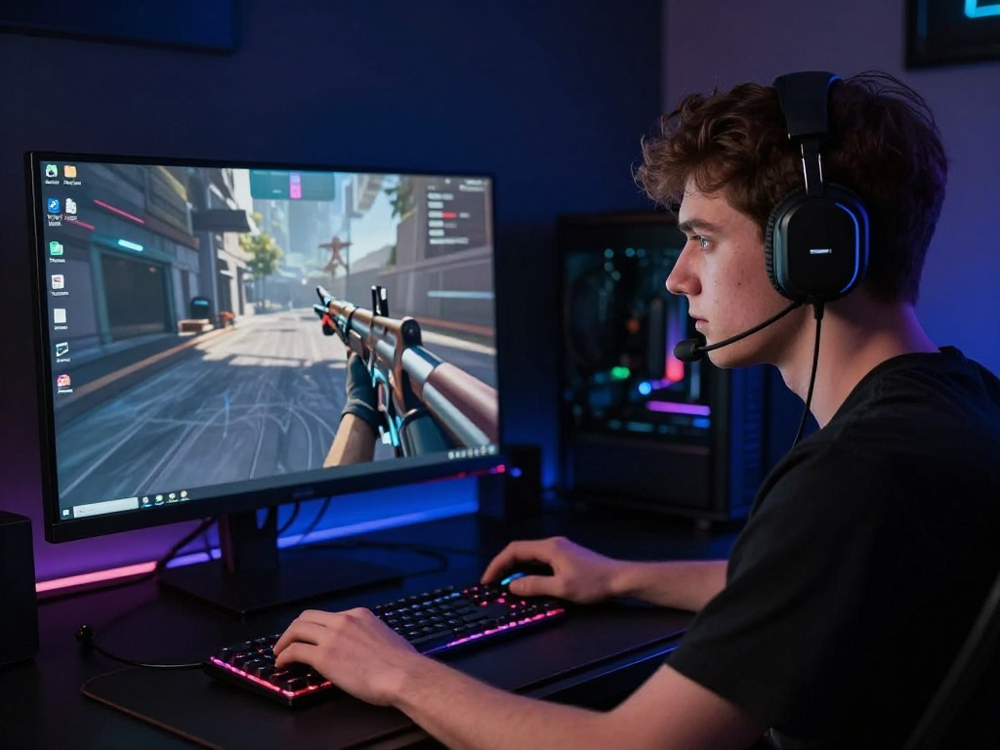

{:style="float: left;margin-right: 25px;margin-top: 10px;"} PortProton — мощный инструмент для запуска Windows игр и приложений на Linux через Wine и Proton. Это альтернатива Lutris и Bottles с расширенными возможностями.

## Установка PortProton

### Скачивание

```bash
cd ~
git clone https://github.com/Castro-Fidel/PortWINE.git
cd PortWINE
```

### Запуск установки

```bash
./portwine_install.sh
```

Следуйте инструкциям установщика.

## Конфигурация PortProton

### Расположение конфигурации

Конфигурация PortProton находится в:
```
~/.config/PortProton/
```

### Настройка пути к директории

Отредактируйте конфиг:
```bash
nano ~/.config/PortProton/portproton.conf
```

## Создание префикса Wine

### Через графический интерфейс

1. Запустите PortProton
2. Выберите "Создать новый префикс"
3. Укажите имя и путь к префиксу
4. Выберите версию Wine/Proton

### Через командную строку

```bash
PORTWINE_CREATE_PREFIX="MyGame" ./PortProton
```

## Установка игры

### Из установщика

1. Запустите PortProton
2. Выберите "Установить игру"
3. Укажите путь к установщику (.exe)
4. Выберите префикс
5. Следуйте инструкциям установщика

### Из уже установленной игры

1. Запустите PortProton
2. Выберите "Добавить игру"
3. Укажите путь к .exe файлу игры
4. Выберите префикс
5. Настройте параметры запуска

## Настройка Proton

### Установка Proton GE

```bash
# Через PortProton
# Настройки -> Wine/Proton -> Скачать Proton GE
```

### Выбор версии Proton

1. Настройки PortProton
2. Wine/Proton
3. Выберите версию Proton для конкретной игры

## Настройка графики

### Включение DXVK/VKD3D

1. Настройки PortProton
2. Графика
3. Включите DXVK для DirectX 9/10/11
4. Включите VKD3D для DirectX 12

### Настройка разрешения

1. Настройки PortProton
2. Графика
3. Установите желаемое разрешение
4. Включите полноэкранный режим

## Решение проблем

### Проблема: Игра не запускается

1. Проверьте логи PortProton
2. Попробуйте другую версию Wine/Proton
3. Установите необходимые компоненты через winetricks

### Проблема: Низкий FPS

1. Включите DXVK/VKD3D
2. Отключите VSync в настройках игры
3. Уменьшите настройки графики в игре

### Проблема: Отсутствует звук

1. Настройки PortProton -> Звук
2. Выберите правильное аудиоустройство
3. Проверьте системные настройки звука

### Проблема: Проблемы с контроллером

1. Настройки PortProton -> Контроллеры
2. Включите поддержку контроллеров
3. Настройте маппинг кнопок

## Полезные команды

```bash
# Запуск PortProton с конкретным префиксом
PORTWINE_PREFIX="MyGame" ./PortProton

# Запуск конкретного .exe
./PortProton /path/to/game.exe

# Отладка
PORTWINE_DEBUG=1 ./PortProton
```

## Интеграция со Steam

PortProton может работать вместе со Steam Proton:

1. Установите Steam
2. Включите Proton для всех игр
3. Для проблемных игр используйте PortProton

## Рекомендации

1. **Создавайте отдельные префиксы** для каждой игры
2. **Используйте Proton GE** для лучшей совместимости
3. **Включите DXVK** для DirectX 9/10/11 игр
4. **Тестируйте разные версии Wine** для проблемных игр
5. **Делайте бэкапы префиксов** перед обновлениями

## Полезные ресурсы

- [PortProton GitHub](https://github.com/Castro-Fidel/PortWINE)
- [Proton GE](https://github.com/GloriousEggroll/proton-ge-custom)
- [WineHQ AppDB](https://appdb.winehq.org/)

---

**Автор:** [ordanax.github.io](https://ordanax.github.io/)  
**Telegram:** [@linux4at](https://t.me/linux4at)  
**MAX:** [Присоединиться](https://max.ru/join/b4GtiNvbjYqeboq-nddswKQJ-cvWiJGoaZdIoV1EUMk)
