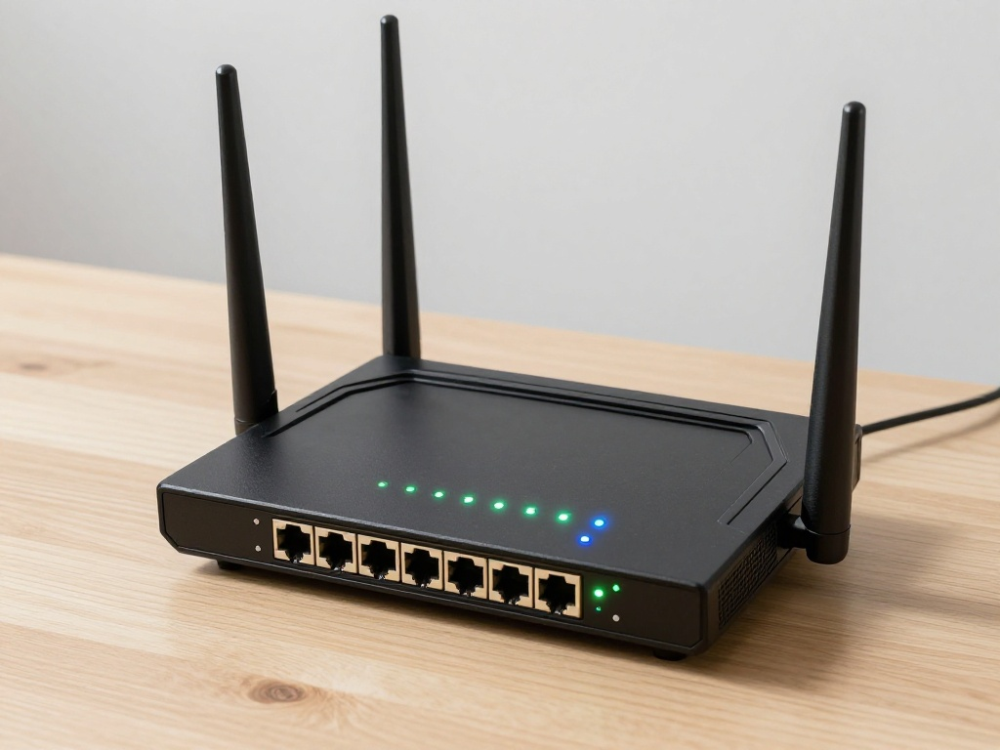

{:style="float: left;margin-right: 25px;margin-top: 10px;"} Настройка Wi-Fi через командную строку — важный навык для любого пользователя Linux. В Arch Linux это делается через wpa_supplicant и dhcpcd. Этот гайд поможет настроить Wi-Fi без графического интерфейса.

## Установка необходимых пакетов

```bash
sudo pacman -S wpa_supplicant dhcpcd dialog
```

- `wpa_supplicant` — для аутентификации в Wi-Fi сетях
- `dhcpcd` — DHCP клиент для получения IP-адреса
- `dialog` — для интерактивных меню (опционально)

## Определение Wi-Fi адаптера

Проверьте, какие сетевые интерфейсы доступны:
```bash
ip link
```

Или:
```bash
iwconfig
```

Wi-Fi адаптер обычно называется `wlan0`, `wlp3s0` или `wlp2s0`.

## Включение Wi-Fi адаптера

```bash
sudo ip link set wlan0 up
```

Замените `wlan0` на имя вашего адаптера.

## Сканирование доступных сетей

```bash
sudo iwlist wlan0 scan | grep ESSID
```

Или через iw:
```bash
sudo iw dev wlan0 scan | grep SSID
```

## Настройка wpa_supplicant

### Метод 1: Через wpa_passphrase (простой)

Создайте конфигурационный файл:
```bash
wpa_passphrase "Название_сети" "Пароль" | sudo tee /etc/wpa_supplicant/wpa_supplicant.conf
```

Пример:
```bash
wpa_passphrase "MyWiFi" "mypassword123" | sudo tee /etc/wpa_supplicant/wpa_supplicant.conf
```

### Метод 2: Ручная настройка

Создайте или отредактируйте файл:
```bash
sudo nano /etc/wpa_supplicant/wpa_supplicant.conf
```

Добавьте:
```conf
ctrl_interface=DIR=/var/run/wpa_supplicant GROUP=wheel
update_config=1

network={
    ssid="Название_сети"
    psk="Пароль"
}
```

Для скрытых сетей добавьте `scan_ssid=1`:
```conf
network={
    ssid="Название_сети"
    scan_ssid=1
    psk="Пароль"
}
```

## Подключение к сети

### Вручную

Запустите wpa_supplicant:
```bash
sudo wpa_supplicant -B -i wlan0 -c /etc/wpa_supplicant/wpa_supplicant.conf
```

- `-B` — запуск в фоновом режиме
- `-i wlan0` — интерфейс
- `-c` — конфигурационный файл

Получите IP-адрес через dhcpcd:
```bash
sudo dhcpcd wlan0
```

### Через systemd (рекомендуется)

Включите и запустите службы:
```bash
sudo systemctl enable wpa_supplicant@wlan0
sudo systemctl start wpa_supplicant@wlan0

sudo systemctl enable dhcpcd@wlan0
sudo systemctl start dhcpcd@wlan0
```

## Проверка подключения

```bash
ip addr show wlan0
ping google.com
```

## Автоматическое подключение при загрузке

### Через systemd

Создайте symlink:
```bash
sudo ln -s /usr/lib/systemd/system/wpa_supplicant@.service /etc/systemd/system/multi-user.target.wants/wpa_supplicant@wlan0.service
sudo ln -s /usr/lib/systemd/system/dhcpcd@.service /etc/systemd/system/multi-user.target.wants/dhcpcd@wlan0.service
```

### Через netctl (альтернативный метод)

Установите netctl:
```bash
sudo pacman -S netctl
```

Создайте профиль:
```bash
sudo cp /etc/netctl/examples/wireless-wpa /etc/netctl/mywifi
```

Отредактируйте профиль:
```bash
sudo nano /etc/netctl/mywifi
```

```conf
Description='My WiFi Network'
Interface=wlan0
Connection=wireless
Security=wpa
ESSID='Название_сети'
Key='Пароль'
IP=dhcp
```

Включите профиль:
```bash
sudo netctl enable mywifi
sudo netctl start mywifi
```

## Решение проблем

### Проблема: wpa_supplicant не запускается

Проверьте логи:
```bash
sudo journalctl -xe
```

Убедитесь, что интерфейс включён:
```bash
sudo ip link set wlan0 up
```

### Проблема: Нет IP-адреса

Проверьте dhcpcd:
```bash
sudo dhcpcd -n wlan0
```

Если не помогает, перезапустите:
```bash
sudo systemctl restart dhcpcd@wlan0
```

### Проблема: Wi-Fi адаптер не виден

Установите firmware:
```bash
sudo pacman -S linux-firmware
```

Перезагрузите систему.

### Проблема: wlan0 меняет название на wlan1 после перезагрузки

Это распространённая проблема, когда сетевые интерфейсы меняют названия после перезагрузки, ломая скрипты и монтирование. Решения:

1. **Создайте правило udev** для фиксации имени интерфейса:
```bash
sudo nano /etc/udev/rules.d/70-persistent-net.rules
```

Добавьте:
```
SUBSYSTEM=="net", ACTION=="add", DRIVERS=="?*", ATTR{address}=="mac:адрес:интерфейса", NAME="wlan0"
```

2. **Используйте предсказуемые имена** через systemd-networkd:
```bash
sudo ln -s /dev/null /etc/systemd/network/99-default.link
```

3. **Настройте таймаут** перед монтированием в fstab, если проблема с автоматическим монтированием. Это поможет избежать ошибок при медленной инициализации сети.

### Проблема: Сеть подключается, но нет интернета

Проверьте DNS:
```bash
cat /etc/resolv.conf
```

Добавьте DNS-серверы:
```bash
sudo nano /etc/resolv.conf
```

```
nameserver 8.8.8.8
nameserver 8.8.4.4
```

## Управление Wi-Fi через iwctl (iwd)

Альтернатива wpa_supplicant — iwd (iwctl):

```bash
sudo pacman -S iwd
sudo systemctl enable iwd
sudo systemctl start iwd
```

Запустите iwctl:
```bash
sudo iwctl
```

Внутри iwctl:
```
device list
station wlan0 scan
station wlan0 get-networks
station wlan0 connect "Название_сети"
exit
```

## Полезные команды

```bash
# Проверка статуса Wi-Fi
sudo iw dev wlan0 link

# Показать уровень сигнала
sudo iw dev wlan0 link | grep signal

# Отключиться от сети
sudo ip link set wlan0 down

# Переподключиться
sudo ip link set wlan0 down
sudo ip link set wlan0 up
sudo wpa_supplicant -B -i wlan0 -c /etc/wpa_supplicant/wpa_supplicant.conf
sudo dhcpcd wlan0
```

## Рекомендации

1. **Используйте systemd** для автоматического подключения при загрузке
2. **Сделайте бэкап** конфигурационных файлов перед изменениями
3. **Проверьте логи** при проблемах через `journalctl`
4. **Используйте iwd** как более современную альтернативу wpa_supplicant
5. **Настройте firewall** после успешного подключения

## Полезные ресурсы

- [ArchWiki: Wireless network configuration](https://wiki.archlinux.org/title/Wireless_network_configuration)
- [ArchWiki: Wpa_supplicant](https://wiki.archlinux.org/wiki/Wpa_supplicant)
- [ArchWiki: Dhcpcd](https://wiki.archlinux.org/wiki/Dhcpcd)

---

**Автор:** [ordanax.github.io](https://ordanax.github.io/)  
**Telegram:** [@linux4at](https://t.me/linux4at)  
**MAX:** [Присоединиться](https://max.ru/join/b4GtiNvbjYqeboq-nddswKQJ-cvWiJGoaZdIoV1EUMk)
